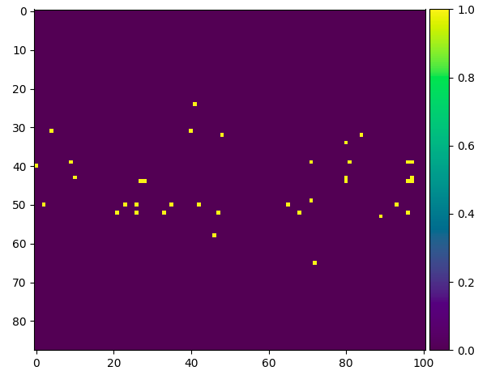
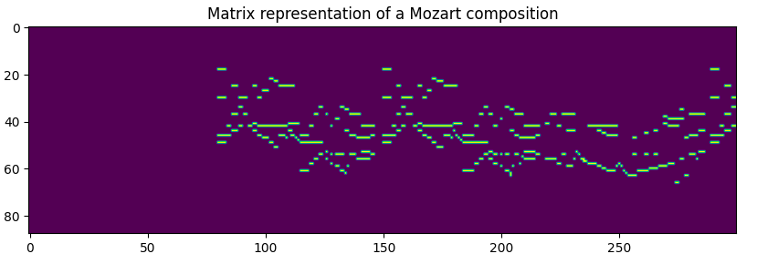
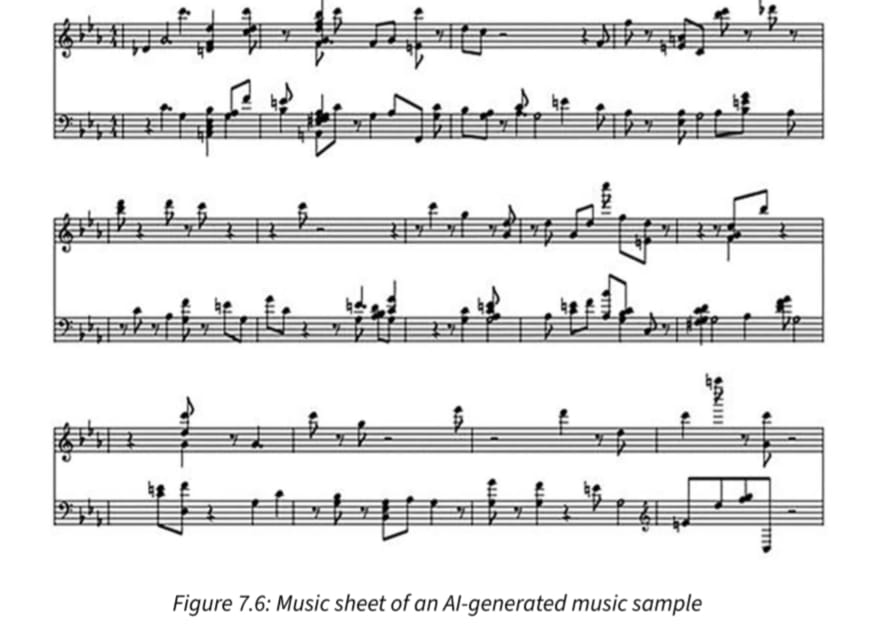

---

# Compose Like Mozart: Music Generation with PyTorch

Welcome to the "Compose Like Mozart" project! This repository showcases an innovative approach to music generation using PyTorch, inspired by the timeless compositions of Wolfgang Amadeus Mozart. 

## Overview

**Compose Like Mozart** leverages state-of-the-art machine learning techniques to generate new music that reflects the elegance and complexity of Mozart’s classical compositions. By training a custom PyTorch model on a curated set of MIDI files, this project demonstrates how generative AI can be used to replicate and innovate upon the rich musical heritage of one of history's greatest composers.

### MIDI Files

MIDI (Musical Instrument Digital Interface) is a standard protocol for communicating musical performance data between digital instruments and computers. MIDI files encode information about musical notes, rhythms, and dynamics, allowing us to capture the essence of compositions and feed them into our machine learning model for training.

## Project Details

### Dataset

The dataset for this project consists of 21 MIDI files of Mozart's compositions. These files are divided into:
- **Training Set:** 18 MIDI files located in the `./mozart/train` folder.
- **Validation Set:** 3 MIDI files located in the `./mozart/valid` folder.

### What We Are Solving

This project addresses the challenge of generating new musical compositions that maintain the stylistic elements of Mozart’s work. By training our model on a substantial dataset of Mozart’s music, we aim to:
- **Generate Original Music:** Create new compositions that reflect Mozart’s musical style.
- **Explore Generative AI Capabilities:** Showcase the potential of AI in the creative domain of music.

### Innovation in Generative AI

This project represents a significant innovation in generative AI by combining classical music with cutting-edge machine learning techniques. By applying deep learning methods to the realm of music composition, we are exploring how AI can contribute to the arts and enhance our ability to create and experience music.

## Images

  
*Mozart compose*

  
*Our generated music*

  
*The notes of the generated music*

## License

This project is licensed under the MIT License. See the [LICENSE](LICENSE) file for details.

---
